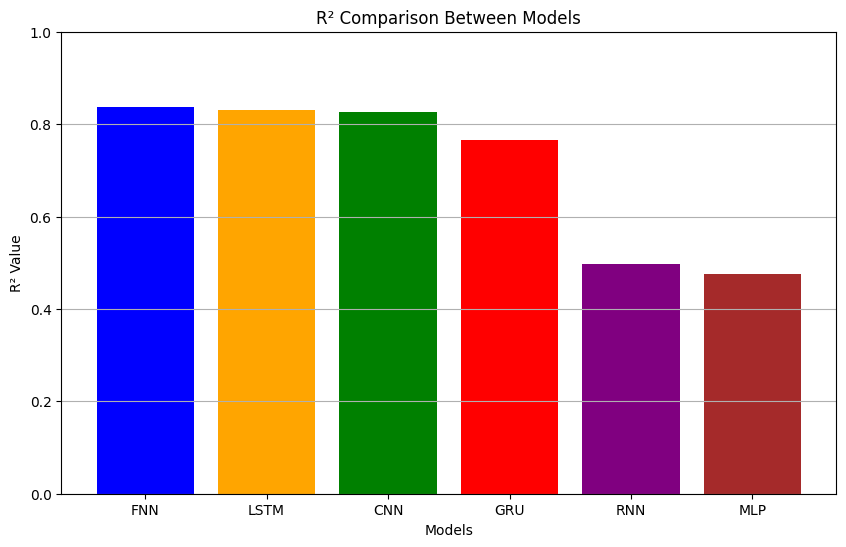
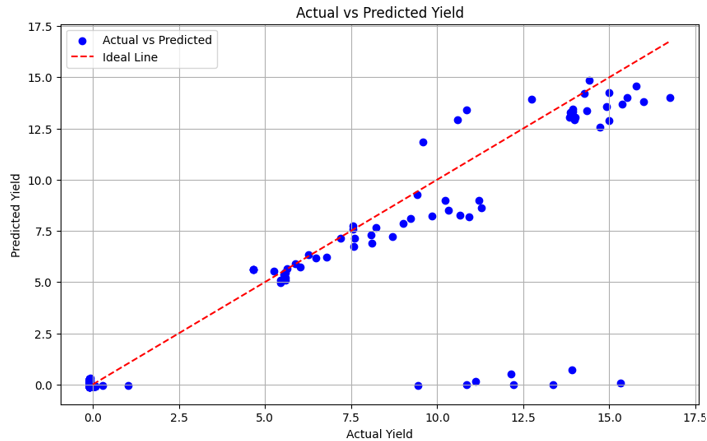
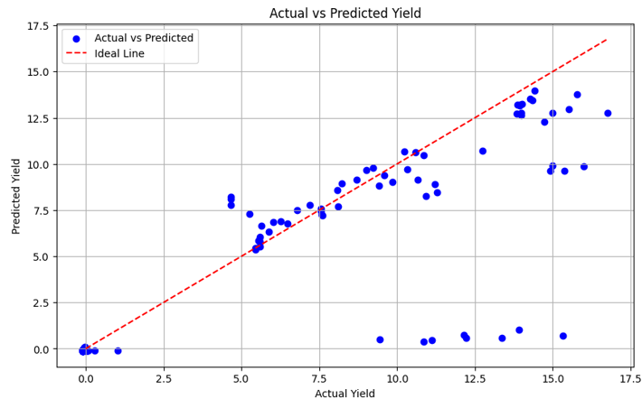
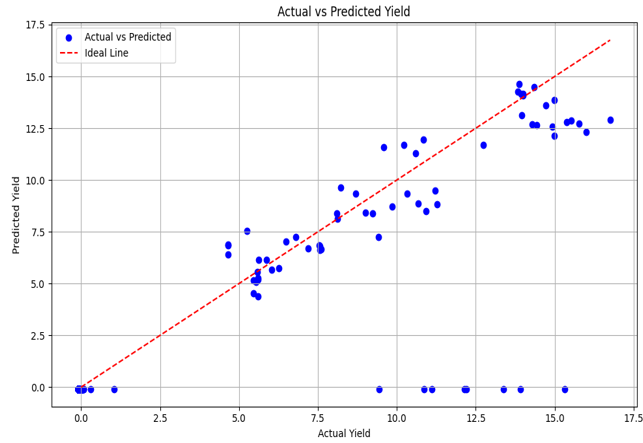
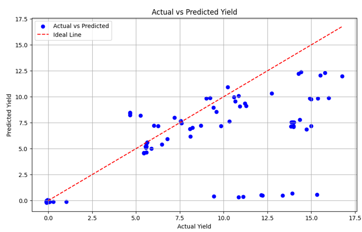
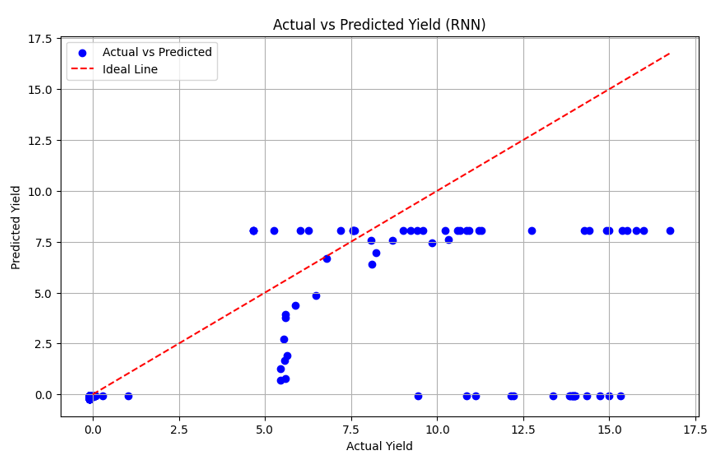
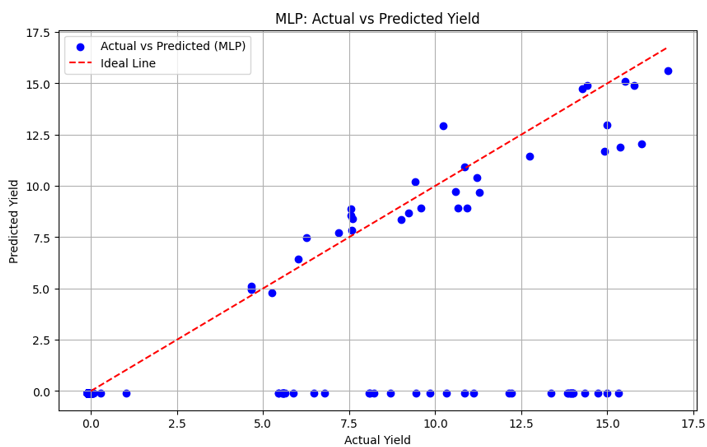

# 🌾 **An Efficient Deep Learning Method to Predict Crop Yield**

## 📜 **Project Overview**
This project focuses on using efficient **deep learning methods** to predict crop yields accurately. Models like Feed Forward Neural Networks (FNN), Long Short-Term Memory (LSTM), Convolutional Neural Networks (CNN), Gated Recurrent Unit (GRU), Recurrent Neural Network (RNN), Multi Layer Perceptron (MLP) were evaluated for their ability to analyze agricultural and environmental data, offering insights for sustainable agriculture.

### **Key Highlights:**
- Evaluation of models: **FNN**, **LSTM**, **CNN**, **GRU**, **RNN**, and **MLP**.
- Dataset includes essential features like crop type, season, area, production,rainfall and environmental conditions.
- Metrics like **MAE**, **MSE**, and **R²** are used for performance evaluation.
- Visualizations for better understanding of model performance and results.

---

## 📊 **Dataset**
- **Source**: Kaggle - Indian Agriculture Crop Production database.
- **Size**: 19,689 entries across 10 columns.
- **Key Features**:
  - `Crop Type`, `Season`, `State`, `Area`, `Production`, `Crop Year`
  - Environmental factors: `Rainfall`, `Fertilizer & Pesticide Usage`
- **Target Variable**: `Crop Yield` (tons/ha).

---

## ⚙️ **System Workflow**

1. **Data Collection**: Extract data from reliable agricultural sources.  
2. **Data Preprocessing**:  
   - **Scaling Numerical Features**: Normalize values to a comparable range (e.g., 0 to 1).  
   - **Encoding Categorical Variables**: Convert non-numeric columns (e.g., Crop, Season, State) into numeric format using label encoding.  
   - **Handling Missing Values**: Apply mean or median imputation for numerical columns and mode imputation for categorical ones.  
   - **Feature and Target Separation**: Split the dataset into independent variables (features) and the dependent variable (target: crop yield).  
   - **Data Splitting**: Divide data into training (60%), validation (20%), and testing (20%) sets.  
3. **Model Training**:  
   - Train six models with ReLU/Sigmoid activation functions.  
   - Use early stopping to prevent overfitting.  
4. **Prediction Module**:  
   - Feed preprocessed data into trained models.  
   - Generate crop yield predictions.  
5. **Evaluation**:  
   - Analyze model performance using metrics like MAE, MSE, and R². 

---

## 🤖 **Deep Learning Models and Results**

| **Model**  | **MAE**    | **MSE**   | **R²**    | **Notes**                                             |
|------------|------------|-----------|-----------|------------------------------------------------------|
| **FNN**    | 0.03688    | 0.1656    | 83.79%    | Best performer, capturing complex relationships.     |
| **LSTM**   | 0.02746    | 0.1722    | 83.15%    | Excels at capturing temporal trends.                 |
| **CNN**    | 0.02538    | 0.1766    | 82.72%    | Effective in spatial feature analysis.               |
| **GRU**    | 0.04062    | 0.2397    | 76.55%    | Lightweight alternative to LSTM with good accuracy.  |
| **RNN**    | 0.05598    | 0.5127    | 49.84%    | Struggles with long-term dependencies.               |
| **MLP**    | 0.05448    | 0.5369    | 47.47%    | Baseline performance due to simpler architecture.    |

---

## 📊 **R² Bar Chart**

The bar chart below compares the R² values of all models. **FNN** and **LSTM** perform the best, with the highest R² values (83.79% and 83.15%, respectively), followed closely by **CNN** with an R² value of **82.72%**. On the other hand, **RNN** and **MLP** have the lowest R² values, indicating their relatively weaker performance in terms of explaining the variance in crop yield predictions.

## 📈 **Scatter Plots**
The scatter plots below illustrate the relationship between the predicted and actual crop yields for each model. Ideally, points should align closely with the diagonal line \(y = x\), indicating perfect predictions.

### **Feed Forward Neural Network (FNN)**

### **Long Short-Term Memory (LSTM)**

### **Convolutional Neural Network (CNN)**

### **Gated Recurrent Unit (GRU)**

### **Recurrent Neural Network (RNN)**

### **Multi-Layer Perceptron (MLP)**

---

## 💡 **Observations**
- The R² Bar Chart shows that FNN and LSTM perform the best with the highest R² values, followed by CNN, while RNN and MLP perform the worst.
- Models like **FNN**, **LSTM**, and **CNN** show a tight clustering of points around the diagonal, indicating strong performance.
- **GRU**, **RNN**, and **MLP** display higher dispersion, suggesting a reduced predictive accuracy.

---

## 📚 **Libraries and Tools**
- **Deep Learning**: TensorFlow, Keras, PyTorch
- **Data Processing**: Pandas, NumPy, Scikit-learn
- **Visualization**: Matplotlib, Seaborn

---

## 🖥️ **System Requirements**

### **Hardware**
- **Processor**: Intel Core i7/i9 or AMD Ryzen 7/9.
- **RAM**: Minimum 8GB (16GB recommended).
- **Storage**: 256GB SSD (minimum), 512GB SSD (recommended).

### **Software**
- **IDE**: Google Colab (GPU-enabled).
- **Programming Language**: Python 3.

---

## 🔮 **Future Work**
1. **Integration of Real-Time Data**:
   - Include live data like soil health and microclimates.
2. **Regional and Crop-Specific Models**:
   - Tailor models for specific crops and regions to improve accuracy.

---

